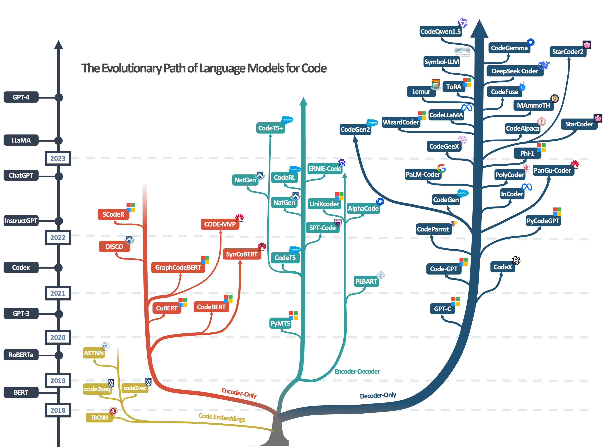
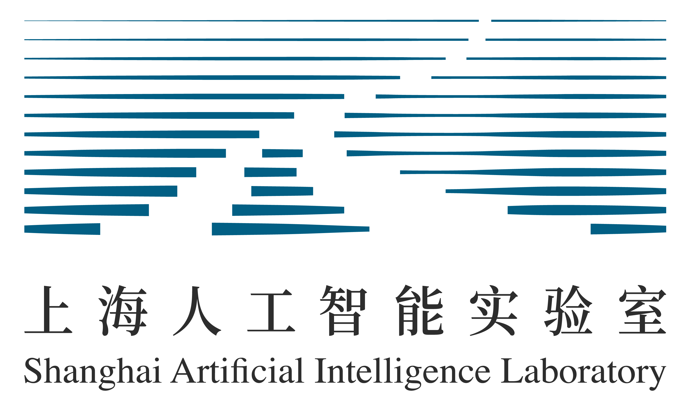
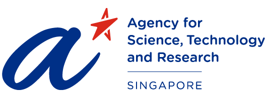
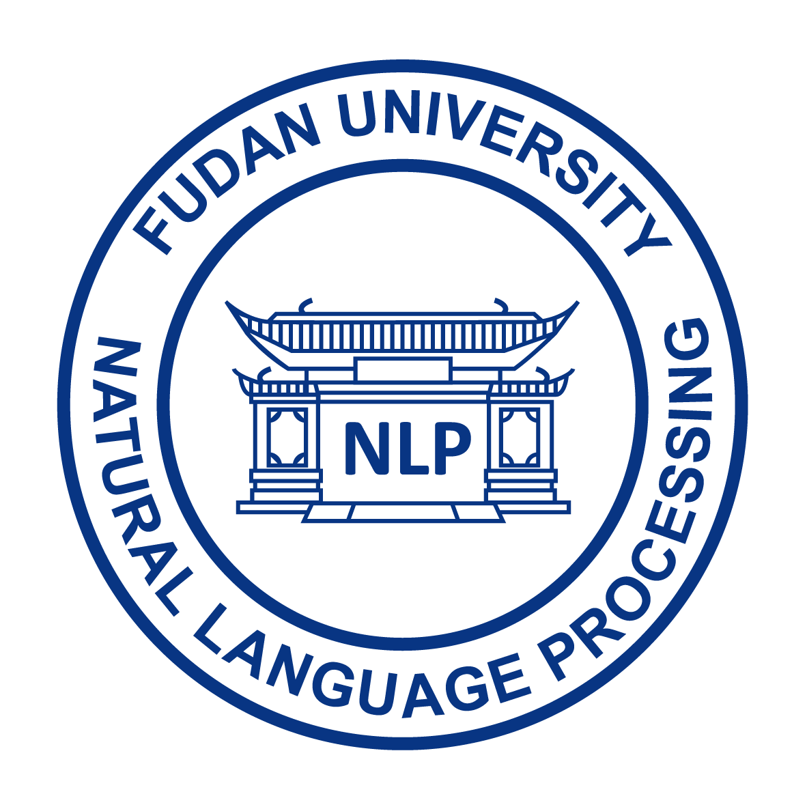

<!-- ## A Survey of Neural Code Intelligence: Paradigms, Advances and Beyond -->

## Neural Code Intelligence Survey
This is the repository of our paper: **A Survey of Neural Code Intelligence: Paradigms, Advances and Beyond**.

 <!-- [[Paper](https://qiushisun.github.io/)] -->

[](https://arxiv.org/abs/2403.14734) 
[](https://GitHub.com/Naereen/StrapDown.js/graphs/commit-activity) 
[](http://makeapullrequest.com)
[](https://awesome.re)

[](https://huggingface.co/papers/2403.14734)
[](https://twitter.com/qiushi_sun)
<!-- [🤗](https://huggingface.co/papers/2403.14734) -->

*Please do not hesitate to contact us or launch pull requests if you find any related papers that are missing in our paper.*

## News 📰
- Update on 2024/06/23: Version 1.2 released 🚀
- Update on 2024/03/19: Version 1.0 released 🚀
- Update on 2024/01/19: Add multiple reading lists 📖
- Update on 2023/12/29: Add Development Timelines 📅
- Update on 2023/12/25: Add Reading Lists, Merry Christmas 🍎🎄

## Introduction 📜

📃 [**A Survey of Neural Code Intelligence: Paradigms, Advances and Beyond**](https://arxiv.org/abs/2403.14734) 
>
> [Qiushi Sun](qiushisun.github.io),
[Zhirui Chen](https://github.com/jet1004),
[Fangzhi Xu](https://xufangzhi.github.io/),
[Kanzhi Cheng](https://scholar.google.com/citations?user=S2IPVnwAAAAJ&hl=zh-CN),
[Chang Ma](https://chang-github-00.github.io/-changma/),
[Zhangyue Yin](https://scholar.google.com/citations?user=9gRQqSkAAAAJ&hl=en),
[Jianing Wang](https://wjn1996.github.io/),
[Chengcheng Han](https://hccngu.github.io/),
[Renyu Zhu](https://scholar.google.com/citations?user=tSWULnAAAAAJ&hl=en), 
[Shuai Yuan](https://github.com/Luciferder),
[Qipeng Guo](https://scholar.google.com/citations?user=k3mPGKgAAAAJ&hl=en),
[Xipeng Qiu](https://xpqiu.github.io/),
[Pengcheng Yin](https://pengcheng.in/),
[Xiaoli Li](https://www.a-star.edu.sg/i2r/about-i2r/i2r-management/li-xiaoli), 
[Fei Yuan](https://github.com/CONE-MT), 
[Lingpeng Kong](https://ikekonglp.github.io/), 
[Xiang Li](https://lixiang3776.github.io/), 
[Zhiyong Wu](https://lividwo.github.io/zywu.github.io/)

Introducing the resources provided by our survey paper.

## Timeline

<details open>
<summary>The Development of Code Intelligence</summary>



</details>


## Recent Work on NCI (Welcome PR) 📗

- [Interactive Evolution: A Neural-Symbolic Self-Training Framework For Large Language Models](https://arxiv.org/abs/2406.11736) 2024.06
- [Symbolic Learning Enables Self-Evolving Agents](https://arxiv.org/pdf/2406.18532v1) 2024.06
- [aiXcoder](https://huggingface.co/aiXcoder/aixcoder-7b-base) 2024.04
- [Making Language Models Better Tool Learners with Execution Feedback](https://arxiv.org/abs/2305.13068) 2024.03


## Paper Collections / Tutorials 📚

- [Language Models for Code](https://github.com/QiushiSun/NCISurvey/blob/main/paper-reading/CodeLMs.md) 🤖
- [Evaluations and Benchmarks](https://github.com/QiushiSun/NCISurvey/blob/main/paper-reading/Benchmarks.md) 📊 
- [Code Repair](https://github.com/QiushiSun/NCISurvey/blob/main/paper-reading/Repair.md) 🔧
- [Reasoning with Code Synthesis](https://github.com/QiushiSun/NCISurvey/blob/main/paper-reading/Reasoning.md) 🧠
- [Data Science](https://github.com/QiushiSun/NCISurvey/blob/main/paper-reading/DS.md) 🔢
- [Corpus containing Code Data](https://github.com/QiushiSun/NCISurvey/blob/main/paper-reading/Code-corpus.md) 📚
- [Code-Based Solutions for NLP Tasks](https://github.com/QiushiSun/NCISurvey/blob/main/paper-reading/NLPTasks-through-code.md) 📝
- [Code Empowered Agents](https://github.com/QiushiSun/NCISurvey/blob/main/paper-reading/CodeLM-empowered-agents.md) 🤖
- [Reinforcement Learning with CodeLMs](https://github.com/QiushiSun/NCISurvey/blob/main/paper-reading/RL-with-CodeLMs.md) 🎮
- [Code Intelligence assists AI4Science](https://github.com/QiushiSun/NCISurvey/blob/main/paper-reading/AI4Science.md) 🧪
- [Software Development](https://github.com/QiushiSun/NCISurvey/blob/main/paper-reading/Software-Development.md) 🛠️
- [Multilingual](https://github.com/QiushiSun/NCISurvey/blob/main/paper-reading/multilingual.md) 🌍
- [Multimodal Code Generation](https://github.com/QiushiSun/NCISurvey/blob/main/paper-reading/Multimodal.md) 🎨
- [Awesome Slides, Talks and Blogs](https://github.com/QiushiSun/NCISurvey/blob/main/paper-reading/tutorials.md) 🧑‍🏫

## Citation 📖

🫶 If you are interested in our work or find this repository helpful, please consider using the following citation format when referencing our paper:

```bibtex
@article{sun2024survey,
  title={A survey of neural code intelligence: Paradigms, advances and beyond},
  author={Sun, Qiushi and Chen, Zhirui and Xu, Fangzhi and Cheng, Kanzhi and Ma, Chang and Yin, Zhangyue and Wang, Jianing and Han, Chengcheng and Zhu, Renyu and Yuan, Shuai and others},
  journal={arXiv preprint arXiv:2403.14734},
  year={2024}
}
```
<!-- 

```bibtex
@misc{sun2024ncisurvey,
  title         = {A Survey of Neural Code Intelligence: Paradigms, Advances and Beyond},
  author        = {Qiushi Sun and Zhirui Chen and Fangzhi Xu and Kanzhi Cheng and Chang Ma and 
                   Zhangyue Yin and Jianing Wang and Chengcheng Han and Renyu Zhu and Shuai Yuan 
                   and Qipeng Guo and Xipeng Qiu and Pengcheng Yin and Xiaoli Li and Fei Yuan and
                   Lingpeng Kong and Xiang Li and Zhiyong Wu},
  eprint        = {2403.14734},
  archivePrefix = {arXiv},
  year          = {2024}
}
``` -->

## Acknowledgements

This is an open collaborative research project among:

<a href="https://huggingface.co/OpenAGILab">
    
</a>
<a href="https://hkunlp.github.io/">
    
</a>
<a href="https://nus.edu.sg/">
    
</a>
<a href="https://github.com/Shark-NLP">
    
</a>
<a href="https://dase.ecnu.edu.cn/">
    
</a>
<a href="https://nlp.fudan.edu.cn/nlpen/main.htm">
    
</a>
<a href="https://deepmind.google/">
    
</a>


## Repository Contributors

<a href="qiushisun.github.io"></a>
<a href="https://github.com/jet1004"></a>
<a href="https://xufangzhi.github.io/"></a>
<a href="https://github.com/Luciferder"></a>
<a href="https://scholar.google.com/citations?user=9gRQqSkAAAAJ&hl=en"></a>
<a href="https://scholar.google.com/citations?user=S2IPVnwAAAAJ&hl=zh-CN"></a>
<a href="https://chang-github-00.github.io/-changma/"></a>
<a href="https://hccngu.github.io/"></a>
<a href="https://wjn1996.github.io/"></a>

<!-- ## Other Good Repos for This Topic -->

## Star History 🌟

[](https://star-history.com/#QiushiSun/NCISurvey&Date)
