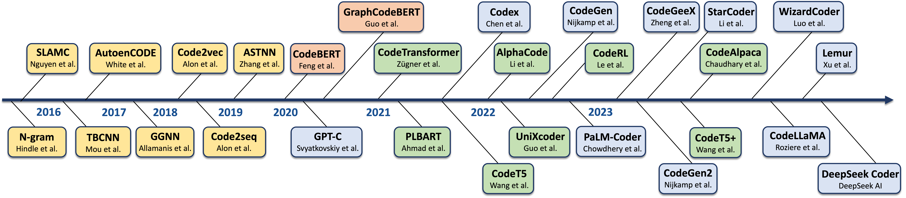

<!-- ## A Survey of Neural Code Intelligence: Paradigms, Advances and Beyond -->
## Neural Code Intelligence Survey
This is the repository of our paper: **A Survey of Neural Code Intelligence: Paradigms, Advances and Beyond**.

 <!-- [[Paper](https://qiushisun.github.io/)] -->

[](https://arxiv.org/abs/2403.14734) 
[](https://GitHub.com/Naereen/StrapDown.js/graphs/commit-activity) 
[](http://makeapullrequest.com)
[](https://awesome.re)

[](https://huggingface.co/papers/2403.14734)
[](https://twitter.com/qiushi_sun)
<!-- [🤗](https://huggingface.co/papers/2403.14734) -->

*若您发现有相关论文未被收录，请通过：qiushisun@u.nus.edu 联系我们或在本仓库提交pull requests*

## Introduction 📜

📃 [**A Survey of Neural Code Intelligence: Paradigms, Advances and Beyond**](https://arxiv.org/abs/2403.14734) 

代码智能综述：范式、进展与未来

## Timeline

<details open>
<summary>The Development of Code Intelligence</summary>



</details>

## 阅读清单 📚

- [代码语言模型](https://github.com/QiushiSun/NCISurvey/blob/main/paper-reading/CodeLMs.md) 🤖
- [评测基准](https://github.com/QiushiSun/NCISurvey/blob/main/paper-reading/Benchmarks.md) 📊 
- [代码修复](https://github.com/QiushiSun/NCISurvey/blob/main/paper-reading/Repair.md) 🔧
- [代码辅助推理](https://github.com/QiushiSun/NCISurvey/blob/main/paper-reading/Reasoning.md) 🧠
- [数据科学](https://github.com/QiushiSun/NCISurvey/blob/main/paper-reading/DS.md) 🔢
- [代码预训练语料库](https://github.com/QiushiSun/NCISurvey/blob/main/paper-reading/Code-corpus.md) 📚
- [代码辅助解决传统NLP任务](https://github.com/QiushiSun/NCISurvey/blob/main/paper-reading/NLPTasks-through-code.md) 📝
- [Agents](https://github.com/QiushiSun/NCISurvey/blob/main/paper-reading/CodeLM-empowered-agents.md) 🤖
- [强化学习](https://github.com/QiushiSun/NCISurvey/blob/main/paper-reading/RL-with-CodeLMs.md) 🎮
- [代码智能辅助AI4Science](https://github.com/QiushiSun/NCISurvey/blob/main/paper-reading/AI4Science.md) 🧪
- [软件开发](https://github.com/QiushiSun/NCISurvey/blob/main/paper-reading/Software-Development.md) 🛠️
- [多语言](https://github.com/QiushiSun/NCISurvey/blob/main/paper-reading/multilingual.md) 🌍
- [资源/博客/报告](https://github.com/QiushiSun/NCISurvey/blob/main/paper-reading/tutorials.md) 🧑‍🏫

## 引用 📖

🫶 如果觉得我们的工作或提供的资源有帮助，欢迎您引用我们的论文:

```bibtex
@misc{sun2024ncisurvey,
  title         = {A Survey of Neural Code Intelligence: Paradigms, Advances and Beyond},
  author        = {Qiushi Sun and Zhirui Chen and Fangzhi Xu and Kanzhi Cheng and Chang Ma and 
                   Zhangyue Yin and Jianing Wang and Chengcheng Han and Renyu Zhu and Shuai Yuan 
                   and Qipeng Guo and Xipeng Qiu and Pengcheng Yin and Xiaoli Li and Fei Yuan and
                   Lingpeng Kong and Xiang Li and Zhiyong Wu},
  eprint        = {2403.14734},
  archivePrefix = {arXiv},
  year          = {2024}
}
```

## 致谢

This is an open collaborative research project among:

<a href="https://huggingface.co/OpenAGILab">
    
</a>
<a href="https://hkunlp.github.io/">
    
</a>
<a href="https://nus.edu.sg/">
    
</a>
<a href="https://github.com/Shark-NLP">
    
</a>
<a href="https://dase.ecnu.edu.cn/">
    
</a>
<a href="https://nlp.fudan.edu.cn/nlpen/main.htm">
    
</a>
<a href="https://deepmind.google/">
    
</a>

## 仓库贡献者

<a href="qiushisun.github.io"></a>
<a href="https://github.com/jet1004"></a>
<a href="https://xufangzhi.github.io/"></a>
<a href="https://github.com/Luciferder"></a>
<a href="https://scholar.google.com/citations?user=9gRQqSkAAAAJ&hl=en"></a>
<a href="https://scholar.google.com/citations?user=S2IPVnwAAAAJ&hl=zh-CN"></a>
<a href="https://chang-github-00.github.io/-changma/"></a>
<a href="https://hccngu.github.io/"></a>
<a href="https://wjn1996.github.io/"></a>

<!-- ## Other Good Repos for This Topic -->

## Star History 🌟

[](https://star-history.com/#QiushiSun/NCISurvey&Date)